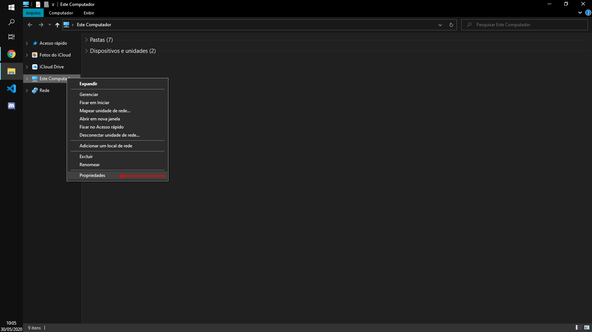
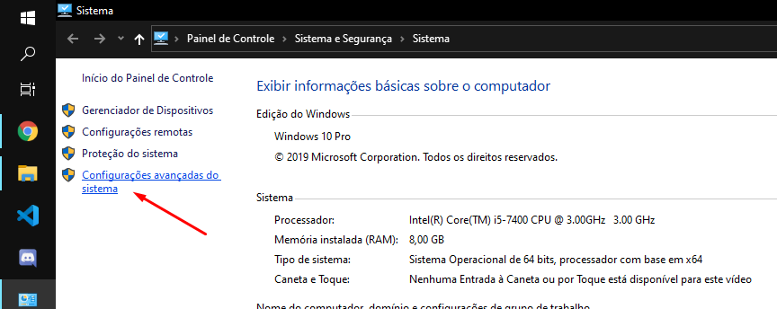
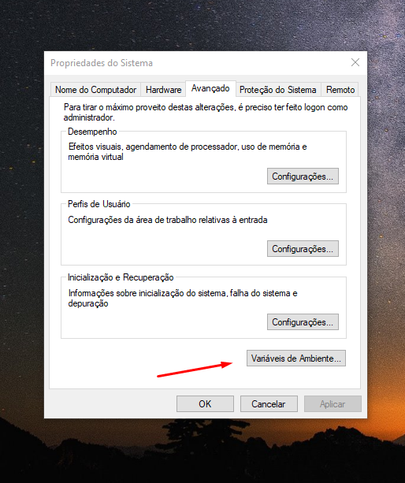
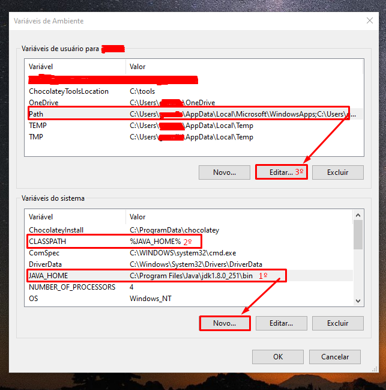

### Configurações do Ambiente Windows

#### Java

Para iniciar será necessário que você faça a instalação do Java, é muito simples de se instalar. O link é <a href="https://www.java.com/pt_BR/download/">esse aqui </a>. Clique em download gratuito do Java e faça a instalação normalmente como qualquer software.

#### JDK (Java Development Kit)

O Java Development Kit é um pacote disponibilizado pelo Oracle que permite o desenvolvimento em **Java**. O link para download está provido <a href="https://www.oracle.com/br/java/technologies/javase/javase-jdk8-downloads.html">aqui</a>, você precisará saber se seu computador é 32 ou 64 bits, com isso, você seleciona a instalação que é compatível com seu computador e instala como um programa normalmente.

#### Testando o Java

Para testar o Java você poderá fazer o seguinte:

<ul>
    <li> Aperte a tecla do Windows + a letra "R". Digite CMD e dê enter nessa "caixinha" que abriu.</li>
    <li>Agora você abriu o terminal, não se assuste, nós iremos verificar somente se o Java está funcionando.</li>
    <li>Digite "javac" e dê enter. Se aparecer conforme está abaixo, está funcionando.
</ul>

Obs: O terminal está assim porque foi testado em Linux, mas o texto é o mesmo.

#### Caso algo tenha dado errado, é bem simples de resolver

Você terá que configurar o path para seu computador entender esse comando.

Siga as seguintes instruções:

<ul>
    <li>Encontre o diretório de instalação do Java e copie ele. Geralmente o padrão é: </li> 
    
    C:\Program Files\Java\jdk1.8.0_65\bin
</ul>
<ul>
    <li>Clique com o botão direito em Meu computador e selecione Propriedades > Avançado.</li>
    
        
    <li>Clique em variáveis de Ambiente e em Variáveis do sistema vamos criar 2 novas variáveis e editar o Path.</li>
    
    <li>Em Variáveis do sistema, vamos em "Novo..." Nome da variável: JAVA_HOME, Valor da Variável: o diretório bin do java</li>
    <li>Novamente em "Novo..." Nome da variável: CLASSPATH, Valor da Variável: %JAVA_HOME%</li>
    <li>Depois em Variáveis de usuário, selecione Path e clique em "Editar..."</li>
    <li>Selecione "Novo" e escreva %JAVA_HOME%
    
    
    <li> Pronto, seu ambiente Windows está configurado.</li>
    Reinicie o CMD e teste novamente.
</ul>

---

### Próximo tópico:

- [Configurando Editor de Texto](./2.2-Editor-de-Texto.md)
