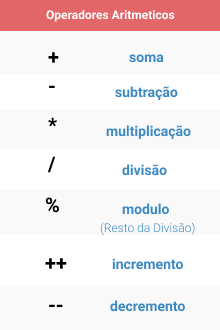

<h1>Operadores matemáticos</h1>
Os operadores matemáticos são de importância fundamental para qualquer tipo de linguagem de programação. Eles são os operadores de adição, subtração, multiplicação, divisão, mod (resto), incremento e decremento.

>Imagem retirada do <a href="https://github.com/hellowluan/java-basico" target="_blank"> repositório do hellowluan.

</a>

<h2> Operador de Adição </h2>
Como o nome já diz, é um operador que realiza uma soma, ele pode ser atribuído dentro de variáveis ou realizando soma de duas variáveis, no exemplo abaixo fará mais sentido.

```java
public class OperadorAdicao {
    public static void main(String args[]) {

        int soma = 5+2; //variável do tipo inteiro de nome "soma" recebe o valor da soma entre 5 e 2;

        System.out.println("O valor da soma 5 + 2 = " + soma);

        //Também pode ser declarado como:
        int num1 = 5; //variável do tipo inteiro de nome "num1" recebe o valor de 5.

        int num2 = 2; //variável do tipo inteiro de nome "num2" recebe o valor de 2.

        int soma2 = num1 + num2; //variável do tipo inteiro de nome "soma2" recebe o valor da soma entre as variáveis de nome "num1" e "num2"

        System.out.println("O valor da soma " + num1 + " + " + num2 + " = " + soma2);

    }
}
```

<h2> Operador de subtração </h2>

Como o nome já diz, é um operador que realiza uma subtração, ele pode ser atribuído dentro de variáveis ou realizando subtrações de duas variáveis, no exemplo abaixo fará mais sentido.

```java
public class OperadorSubtracao {
    public static void main(String args[]) {

        int subtracao = 10-4; //variável do tipo inteiro de nome "subtracao" recebe o valor da subtração entre 10 e 4;

        System.out.println("O valor da subtração 10 - 4 = " + soma);

        //Também pode ser declarado como:
        int num1 = 10; //variável do tipo inteiro de nome "num1" recebe o valor de 10.

        int num2 = 4; //variável do tipo inteiro de nome "num2" recebe o valor de 4.

        int subtracao2 = num1 - num2; //variável de nome "subtracao2" recebe o valor da subtração entre as variáveis de nome "num1" e "num2"

        System.out.println("O valor da subtracao entre " + num1 + " - " + num2 + " = " + subtracao2);

    }
}
```

<h2> Operador de multiplicação </h2>

Como o nome já diz, é um operador que realiza uma multiplicação, ele pode ser atribuído dentro de variáveis ou realizando subtrações de duas variáveis, no exemplo abaixo fará mais sentido.

```java
public class OperadorMultiplicacao {
    public static void main(String args[]) {

        int multiplicacao = 10*5; //variável inteira de nome "multiplicacao" recebe o valor da multiplicação entre 10 e 5;

        System.out.println("O valor da multiplicacao 10 * 4 = " + multiplicacao);

        //Também pode ser declarado como:
        int num1 = 10; //variável inteira de nome "num1" recebe o valor de 10.

        int num2 = 5; //variável inteira de nome "num2" recebe o valor de 5.

        int multiplicacao2 = num1 * num2; //variável de nome "multiplicacao2" recebe o valor da multiplicacao entre as variáveis de nome "num1" e "num2"

        System.out.println("O valor da multiplicacao entre " + num1 + " * " + num2 + " = " + multiplicacao2);

    }
}
```

<h2> Operador de divisão </h2>

Como o nome já diz, é um operador que realiza uma divisão, ele pode ser atribuído dentro de variáveis ou realizando subtrações de duas variáveis, no exemplo abaixo fará mais sentido.

```java
public class OperadorDivisao {
    public static void main(String args[]) {

        int divisao = 10/5; //variável do tipo inteiro de nome "divisao" recebe o valor da divisão entre 10 e 5;

        System.out.println("O valor da divisão 10 / 5 = " + divisao);

        //Também pode ser declarado como:
        int num1 = 10; //variável do tipo inteiro de nome "num1" recebe o valor de 10.

        int num2 = 5; //variável do tipo inteiro de nome "num2" recebe o valor de 5.

        int divisao2 = num1 / num2; //variável de nome "divisao2" recebe o valor da divisao entre as variáveis de nome "num1" e "num2"

        System.out.println("O valor da divisao entre " + num1 + " / " + num2 + " = " + divisao2);

    }
}
```


<h2> Operador de Mod </h2>

Esse operador retorna o resto de de uma divisão. O exemplo a baixo fica mais simples de entender.

```java
public class OperadorMod {
    public static void main(String args[]) {

        int mod = 10%5; //variável do tipo inteiro de nome "mod" recebe o valor do resto da divisão entre 10 e 5;

        System.out.println("O valor da divisão 10 / 5 = " + divisao);

        //Também pode ser declarado como:
        int num1 = 10; //variável do tipo inteiro de nome "num1" recebe o valor de 10.

        int num2 = 5; //variável do tipo inteiro de nome "num2" recebe o valor de 5.

        int mod2 = num1 % num2; //variável de nome "mod2" recebe o valor do resto da divisão entre as variáveis de nome "num1" e "num2"

        System.out.println("O valor da multiplicacao entre " + num1 + " * " + num2 + " = " + mod2);

    }
}
```

<h2> Incremento e Decremento </h2>
Estes operadores são a forma reduzida de fazer uma variável incrementar em 1 e decrementar em 1. São muito utilizados e importantes de se entender como eles funcionam.

```java
public class IncrementoDecremento {
    public static void main(String args[]) {
        int variavel1 = 10; //variável do tipo inteiro de nome "variavel1" recebe o valor 10.
    
        System.out.println(variavel1); //mostra o valor da variavel1

        variavel1++;//incrementa o valor da do tipo inteiro em 1.

        System.out.println(variavel1); //mostra o valor da variavel1 incrementada

        int variavel2 = 20; //variável do tipo inteiro de nome "varivel2" recebe o valor de 20.

        System.out.println(variavel2); //mostra o valor da variavel2

        variavel2--; //decrementa o valor da variavel2 em 1.

        System.out.println(variavel2); //mostra o valor da variável2 decrementada.
 
    }
}
```

**Obs**.: Operações entre parênteses serão resolvidas primeiro, depois  multiplicação, divisão e módulo.

[Próximo](./06-LendoDadosDaEntradaPadrao.md) - Lendo dados de entrada padrão