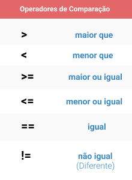

<h1> Operadores Lógicos e de Comparação </h1>
Ambos os operadores são utilizados na maioria em estruturas de condição, que vamos ver agora. Os exemplos de código estarão nesse módulo para fazer mais sentido.

<h2> Operadores Lógicos </h2>

>Imagem retirada do <a href="https://github.com/hellowluan/java-basico" target="_blank"> repositório do hellowluan.

 </a>

Se você conhece algum tipo de lógica de programação, já entendeu como eles funcionam, mas para esclarecer entraremos em mais detelhes.

<h2> Operadores de Comparação </h2>

>Imagem retirada do <a href="https://github.com/hellowluan/
java-basico" target="_blank"> repositório do hellowluan.

 </a>

Esses Operadores são como na matemática, e na programação é possível comparar valores também, e é onde os operadores lógicos entram nessa brincadeira.

[Próximo](./08-EstruturasCondicionais.md) Estrutuas condicionais