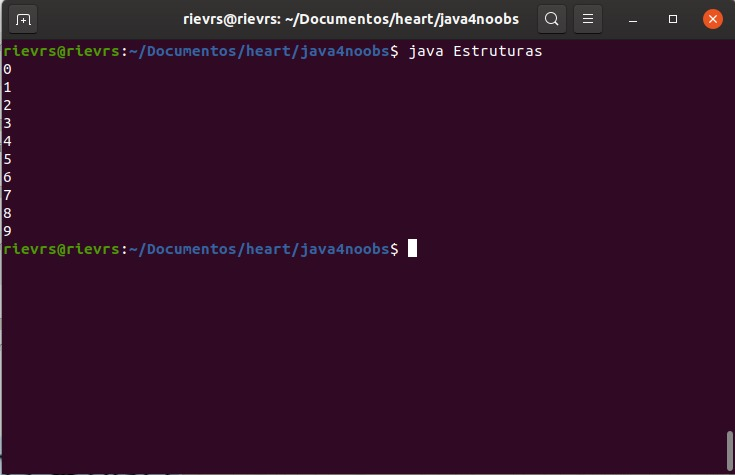

<h1>Estruturas de Repetição</h1>
As estruturas de repetição são estruturas que fazem o código repetidas vezes até que uma condição seja atingida. Se não houver condição, o programa roda infinitamente até ele parar sozinho, isto claramente é um bug. As estruturas que serão apresentadas são: do/while, while e for.

<h2>Do/While</h2>
O do/while é uma estrutura que inicia sem olhar nenhuma condição de parada, roda o que tem dentro das chaves e depois verifica a condição. A variável que vai gerar a condição de parada precisa ser criada fora da estrutura.

```java
public class EstruturaDoWhile {
    public static void main(String args[]) {
        int contador = 0; //iniciando a variável com 0 para certificar esse valor para ela

        do {

            System.out.println(contador); //mostra o contador até atingir a condição de parada.

            contador++; //incrementando para ir chegando perto da condição de parada.

        } while (contador < 10); //leia-se: "faça enquanto o contador seja menor do que 10, quando ele chegar a 10 ele pare". 
        
        //A condição de parada neste exemplo é quando o contador se iguala a 10 ou passa de 10.


    }
}
```

<h2>While</h2>
O while é uma estrutura que inicia olhando a condição de parada, se já tiver sido atingida não entra no bloco de repetição, se não tiver atingido a condição de parada, roda o que tem dentro das chaves e depois verifica a condição novamente. A variável que vai gerar a condição de parada precisa ser criada fora da estrutura.

```java
public class EstruturaWhile {
    public static void main(String args[]) {
        int contador = 0; //iniciando a variável com 0 para certificar esse valor para ela

        while (contador < 10) {

            System.out.println(contador); //mostra o contador até atingir a condição de parada.

            contador++; //incrementando para alcançar a condição de parada.


        } //leia-se: "Enquanto o contador seja menor do que 10, quando ele chegar a 10 ele pare". 
        
        //A condição de parada neste exemplo é quando o contador se iguala a 10 ou passa de 10.


    }
}
```
<h2>For</h2>

O for é uma estrutura de repetição mais compacta, na qual, o bloco já determina aonde começa, a condição de parada e o passo dela (que é como essa variável se comportará para atingir a condição de parada), não é necessário declarar a variável antes, ela pode ser criada dentro da condição.

```java
public class EstruturaFor {
    public static void main(String args[]) {
        for(int contador = 0; contador < 10; contador++) { //declara a variável inicializando-a, coloca a condição de parada, e o passo.

            System.out.println(contador); //mostra a variável contador até o fim da condição de parada.
        }
    }
}

```
Todas as suas saídas devem ser essa:


<h2>For Each</h2>

É um tipo de For mais simplificado, mas mantém o mesmo princípio. Normalmente utilizada com Arrays, onde a variável que está dentro do For Each irá receber o valor da variável que você quer percorrer(começando na posição 0), e a cada ciclo adiciona mais uma posição, até percorrer todo o Array.

```java
public class EstruturaForEach {
    public static void main(String args[]) {
        int[] array = {1,2,3}; //veremos Arrays em uma próxima aula.
        for(int contador : array) { //a variável iniciadora deve ser do mesmo tipo da que você quer percorrer.

            System.out.println(contador); //mostra o contador até que o array tenha todas as posições percorridas.
        }
    }
}
```
[Próximo](./11-Break-Continue.md) - Break e Continue