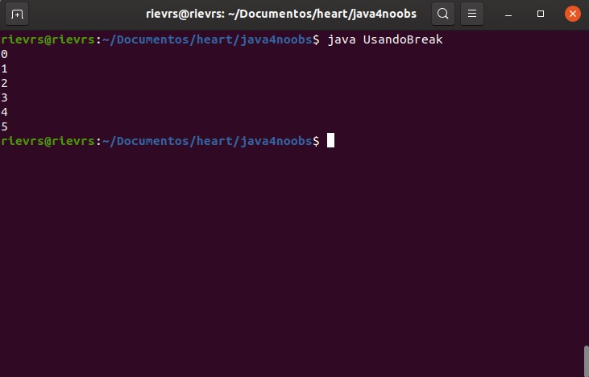
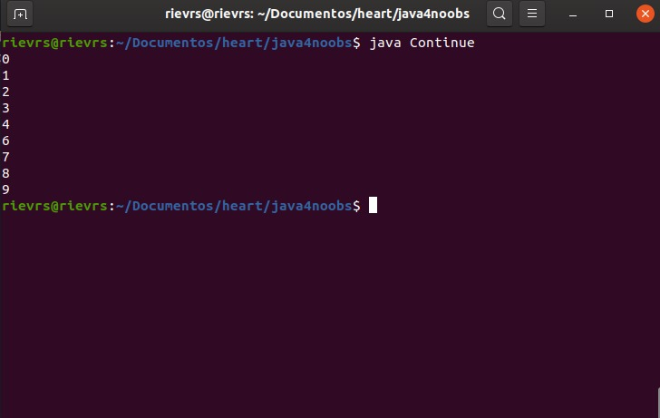

<h1>Continue e Break</h1>

O Continue e o Break é um complemento para estruturas de repetição, eles causam algumas peculiaridades nessas estruturas.

<h2> Break </h2>
O break, como a tradução sugere, quebra e estrutura, se você incluir um break em qualquer parte da estrutura, ele se encerra naquele momento e não executa o que está abaixo dela, independente da condição de parada. Por exemplo:

```java
public class UsandoBreak {
    public static void main(String args[]) {
        for(int i = 0; i < 10; i++) {

            System.out.println(i);

            if (i == 5) { //se o i chegar em 5, ele entra no if
                break; //quebra e sai da estrutura de repetição continuando o código.
            }
        }
    }
}
```

Teria que ficar assim:


<h2>Continue</h2>

O comando Continue é usado somente em laços de repetição. Quando ele é executado, o laço avança um passo e volta imediatamente para o teste de condição do laço de repetição. Por exemplo:

```java
public class Continue {
        public static void main(String args[]) {
                for(int i = 0; i < 10; i ++) {

                    if(i == 5) {
                        continue;
                    }

                    System.out.println(i);
                }
        }
}
```

Teria que ficar assim:

Observe que o valor 5 não foi exibido. Isso ocorreu pois o Continue foi utilizado, portanto, todo o código que está abaixo do continue foi ignorado. Quando atingiu 6, a condição do if não foi satisfeita e a condição for seguiu até o fim.

[Próximo](./12-Funcoes-Metodos.md) - Funções e métodos