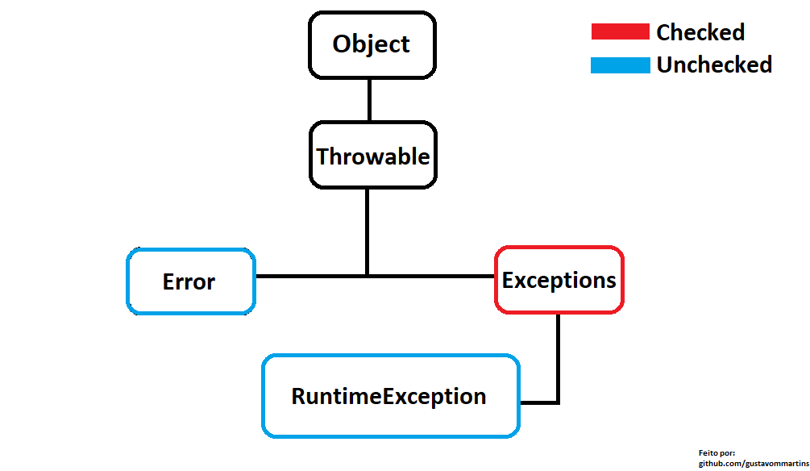

<h1>Exceções</h1>

Neste módulo, abordaremos os diferentes tipos de exceções presentes no Java, discutindo cada uma delas, bem como as estratégias para lidar com essas exceções e como declarar novas exceções em nosso código. É importante compreender as exceções e saber como tratá-las, uma vez que uma exceção indica que algo está incorreto no fluxo do programa, e erros no fluxo podem resultar na interrupção da aplicação. Aprofundar-se nesse tema permitirá que você identifique e solucione problemas, garantindo o bom funcionamento de suas aplicações.

<h2>Tipos de Exceções</h2>

Primeiro vamos conhecer os tipos de exceções que temos no Java, iremos falar sobre alguns conceitos de POO que estão ligados aos tipos de exceções, mas não se preocupe que vamos conhecer mais sobre POO no próximo modulo intermediário.



<h3>Throwable</h3>

Considerada a classe mãe das exceções, ou seja, toda exceção ou erro é considerada uma subclasse de Throwable.

<br>

<h3>Error</h3>

Erros sempre vai acontecer em tempo de execução e é uma condição considerada irrecuperável, ou seja, a sua aplicação é encerrada após tomar um throwable do tipo erro. Não pode ser tratada com blocos Try-catch pois os erros estão ligados a JVM normalmente são considerado "problemas" de baixo nível, como falta de memória, falhas de hardware ou problemas no sistema operacional.

<h3>Alguns exemplos de Throwable do tipo "Error"</h3>

> OutOfMemoryError -> Esse erro se dá quando a JVM não consegue alocar mais memória.

> StackOverflowError -> Acontece quando a quantidade de memória da pilha é ultrapassada.

> NoClassDefFoundError -> Ocorre quando a JVM não consegue encontrar a sua classe.

<br>

<h3>Exceptions</h3>

As exceções são problemas que podem ocorrer durante a execução de um programa Java, mas não causam um colapso total do programa, e podem ser previstas e tratadas através dos blocos de exceção. As exceções são divididas em duas categorias: exceções verificadas (checked exceptions) e exceções não verificadas (unchecked exceptions) que são chamadas de RuntimeException. As exceções verificadas são aquelas que exigem tratamento explícito, ou seja, necessitam da utilização dos blocos de exceções, enquanto as exceções não verificadas não requerem tratamento explícito ou a utilização dos blocos de exceções, mas é considerado boa pratica a utilização, pois caso não tenha o bloco Try-Catch, o seu programa se encerrará com a exception.

<h3>Alguns exemplos de Exceptions do tipo "Checked"</h3>

> FileNotFoundException -> Ocorre quando um arquivo não pode ser encontrado durante uma leitura.

> SQLException -> Ocorre quando estamos lidando a nível de banco de dados, pode ser de erro de conexão, consultas invalidas pelo banco etc.

<h3>Alguns exemplos de Exceptions do tipo "Unchecked"</h3>

> ArrayIndexOutOfBoundsException -> Quando tenta acessar um index do array no qual não existe.

> NullPointerException -> Talvez a exception mais comum de acontecer, quando tentamos acessar ou executar alguma referencia (objeto) que esteja null ou seja nunca foi inicializada.

<h2>Criando suas exceções</h2>

Você também pode criar suas exceções no Java para algum determinado fluxo ou alguma regra de negócio que possa disparar algum erro, assim facilitando a localização e descobrindo o que pode ter acontecido pelo caminho. Para isso, basta criar uma classe que herde alguma classe de erro, como `RuntimeException` ou `Exception`.

```java
public class MinhaExcecao extends RuntimeException {
    //Chame os contrutores da classe mãe.

    //Esse por exemplo você so coloca a mensagem que deseja expor no erro
    public MinhaExcecao(String mensagem) {
        super(mensagem);
    }
    
    //Esse vai expor a mensagem e o erro completo com um caminho de todo o código até chegar nele é um ponto importante para futuros debugs.
    public MinhaExcecao(String mensagem, Throwable error) {
        super(mensagem, error);
    }
}
```
 
 > Obs: Para criar uma exception do tipo checked basta utilizar o "extends Exception".

Agora um exemplo de como voce poderia utilizar a sua exceção

```java
public class ExemploMinhaExcecao {

    public static void main(String[] args) {
        //Caso tenha algum fluxo que você ache nessário utilizá-la basta usar o código abaixo
        throw new MinhaExcecao("Opa, você caiu na minha exceção!");        
    }
}
```

<h2>Blocos de exceções</h2>

As exceções tem três blocos, sendo dois deles obrigatórios. O **try**, **catch** e o **finally**. Se o **try** for utilizado, é necessário utilizar **catch** ou **finally**. Isso é, pode existir as seguintes combinações:
<li> try, catch </li>
<li> try, finally </li>
<li> try, catch, finally </li>

<h2>Construção das Exceções</h2>

>Exemplo modificado do site <a href="https://www.devmedia.com.br/tratando-excecoes-em-java/25514">DevMedia</a>
```java
public class Excecoes {
    public static void main(String args[]) {
        String frase = null;
        String novaFrase = null;

        try {
            novaFrase = frase.toUpperCase();

        } catch(Exception e) { //CAPTURA DA POSSÍVEL exceção. 
            //TRATAMENTO DA exceção
            System.out.println("O frase inicial está nula, 
            para solucional tal o problema, foi lhe atribuito um valor default.");
            frase = "Frase vazia";
            novaFrase = frase.toUpperCase();
        } finally {
            System.out.println("Frase antiga: "+frase);
            System.out.println("Frase nova: "+novaFrase);

        }

        
    }
}
```
O bloco try se inicia para tentar fazer o que está dentro dele, se der errado, terá um catch que irá pegar uma exceção, nesse caso foi generalizado mas é possível especificar elas. Quando cai dentro do catch, ele realiza o código que está dentro. 

Podem existir vários blocos de catch, assim como os else if, as exceções são capturadas pela ordem que foram posicionadas. Ao fim de tudo se realiza o bloco finally, independente se erros foram capturados.