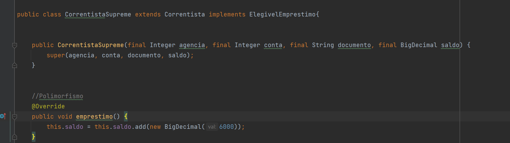
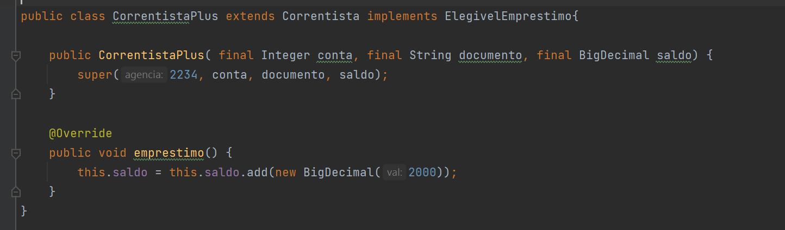
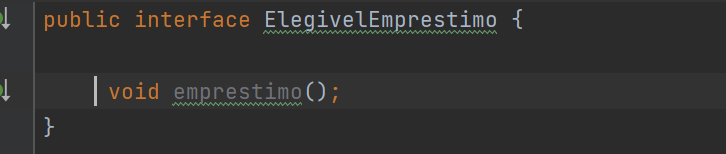
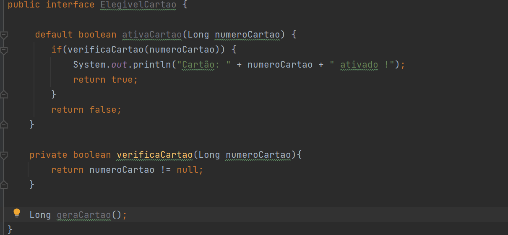

<h1>Interfaces</h1>

Interfaces podem ser definidas como um _“contrato”_ que as classes que a implementam devem implementar seguindo sua assinatura. Dentro do mundo de POO servem para garantir coesão dentro da classe e garantir também o **polimorfismo**. Portanto, as interfaces nos ajudam a desenhar nossas classes conforme uma especificação comum para uma determinada abstração.

**Polimorfismo, por sua vez, pode ser entendido como a capacidade de diferentes classes executarem o mesmo método, com a mesma assinatura, porém com distintas implementações.**

Sendo assim, podemos entender que as interfaces permitem que utilizemos os mesmos métodos, porém em pedaços diferentes do nosso código e com implementações diferentes para cada caso.

Vamos imaginar um seguinte cenário: estamos criando um sistema para um banco com Java, dentro do nosso cenário o gerente autorizará o empréstimo para os clientes, porém cada segmento(tipo) de cliente terá um valor pré-aprovado de empréstimo diferente.

Observe que na classe CorrentistaSupreme, temos o mesmo método e retorno que na classe CorrentistaPlus, porém estamos pré-aprovando valores diferentes. Isso garante que tenhamos a mesma assinatura independente da classe trabalhada.

> Se observar a interface ElegivelEmprestimo, notará que seu nome já explica que os que a implementam tornam-se elegíveis a empréstimo, com diferentes valores. Sua assinatura é de retorno void, e o nome do método será empréstimo, sem nenhum parâmetro. Além disso, por padrão ,todo método que deve ser implementado é público e não pode conter um body. 

> Entretanto, a partir do Java 9 podemos usar também métodos privados, padrão e estáticos dentro do nosso código, permitindo que coloquemos alguns métodos padrões já inseridos na execução de algum outro método padrão.

Nesse caso, o usuário além de implementar a geração de cartão, já terá definido por padrão um método de ativação de cartão, o qual nós já especificamos como deverá se comportar, sem ter que criar uma classe para isso e estendê-la.

Vale ressaltar que também há implementações possíveis para o uso de _static_ e _abstract_ nas interfaces a partir do Java 9.
