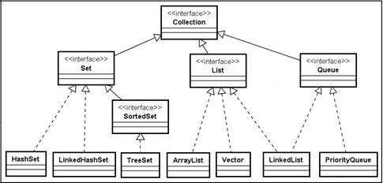

<h1>Collections e Stream API</h1>

<u>Collections Framework</u>

Collections Framework foi um recurso criado no Java para facilitar o trabalho do desenvolvedor com o uso de Arrays e elementos que necessitavam ser agrupados em estrutura de dados como Listas ou Filas. Esse framework é composto por várias classes e interfaces, sendo a mãe delas a interface Collection.

Uma Collection pode ser definida como um agrupamento de objetos do mesmo tipo representados em um único objeto, isso permite com que haja uma maior flexibilidade do que no uso de Arrays, tanto por permitir tipos além dos primitivos, como pela criação de Arrays dinâmicos, otimizando o uso de memória e processamento.



Dentro de duas implementações existem duas grandes API: **Iterator e ListIterator**, ambas possuem suas vantagens e diferenças, porém tem como objetivo comum percorrer um Array elemento a elemento.

Seu uso facilita o agrupamento de dados nessa estrutura, principalmente ao usarmos suas classes filhas, como LinkedList ou ArrayList.

<h1>Stream API</h1>

Com a chegada do Java 8, muitos recursos vieram para melhorar o desempenho da linguagem e facilitar para os desenvolvedores, um desses recursos foi a API Stream. Essa API(conjunto de métodos e funções) fornece a principal vantagem de otimizar o uso da memória e trabalhar com a Lista de forma paralela, o que melhora o processamento. Ela por sua vez retorna um novo array, baseado na Collection antiga, com novos métodos e usos.

```java
List<String> arrayList = new ArrayList<String>();

Stream<String> streamList = arrayList.stream();

//Filtro de um Array;
streamList.filter()

//ForEach
streamList.foreach();

//Ordenar
streamList.sorted();


List<String> novaLista = streamList.collect(toList());

```

Se você reparar o fluxo que fizemos, primeiro filtramos, depois aplicamos uma função para cada elemento, depois reordenamos e por fim coletamos, dessa foram podemos entender a API Stream também como um fluxo de operações as quais podemos fazer sobre uma coleção, de forma paralela e que no fim podemos coletar uma nova coleção com os métodos utilizados, de certa forma podemos fazer uma analogia da API Stream com uma _Pipeline_.

[Próximo](./08-LinkedList-vs-ArrayList.md) - List, ArrayList e LinkedList
