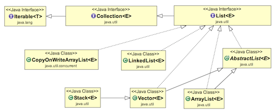
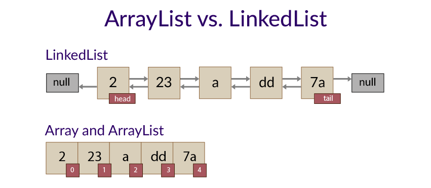

# List, ArrayList e LinkedList

<p align="center" style="font-size: 1.5rem;"><u>Estrutura de Dados</u></p>

Muitas vezes você já deve ter ouvido falar do termo "Estrutura de Dados", esse termo, de uma forma enxuta, refere-se a uma coleção de valores e operações que implementam um tipo abstrato de dado. Em outras palavras, podemos defini-lo como a estrutura na qual agrupamos, operamos e definimos nossa abstração de dados.

Pense a respeito de uma fila de clientes em um banco, temos várias pessoas nessa fila, cada uma com seus dados próprios como CPF, Nome, Número da Conta. Se fossemos pensar em POO, teriamos por exemplo vários objetos que estendem uma classe "Cliente" e implementam interfaces que permitem operações como Saque, Depósito entre outras.

Agora, vamos supor que temos o seguinte problema: Como ordenar esses clientes? Como saber quem é o próximo a ser chamado? Como saber se há mais alguém na fila ?

Para solucionar alguns desses problemas, podemos agrupar nossos dados (clientes) em estruturas de dados que nos facilitam bastante o trabalho, uma delas é a Lista (List) a qual veremos em seguida.

<p align="center" style="font-size: 1.5rem;"><u>List</u></p>



Como pode ver na imagem, dentro da linguagem Java a estrutura List é uma interface, a qual estende Collection, que por sua vez estende Iterable. Não vamos nos aprofundar nos últimos dois, porém Collection refere-se a uma coleção de objetos representados como uma entidade única, e Iterable algo que pode ser iterável. Quando realizamos um laço For estamos fazendo iterações, ou seja, passando por um objeto mais de uma vez, dessa forma, natural que uma Coleção seja iterável e uma lista também seja uma coleção.

Porém, você deve estar se perguntando agora: "Qual é a diferença então entre um List e um Array?" Pois bem, podemos destacar uma diferença principal: Quando criamos um array em Java, devemos declarar também o tamanho desse Array, ou por padrão o compilador irá pré-alocar um espaço de memória para esse Array, mas esse tamanho é fixo e não pode ser expandido, então se precisarmos aumentar esse tamanho, precisamos criar um novo Array. Já em uma List, trabalhamos com um Array dinâmico, o Array criado contém a nossa coleção, porém são adicionados mais alguns espaços de memória, permitindo que sejam adicionados novos elementos sem que necessitamos criar um novo Array na memória.

Além disso, quando usamos uma List, caso a nossa List passe esse tamanho pré-estabelecido, o próprio compilador se ocupa de criar uma nova List com um tamanho maior, comportar a antiga e então deletar a antiga. Já usando o Array, necessitamos criar um novo e deletar o antigo manualmente, caso contrário o espaço continuará alocado na memória.

```java
// Vamos inicializar um Array de 5 posições
int[] umArray = {0,1,2,3,4};
// agora vamos adicionar um novo elemento.
novoArray = Arrays.copyof(umArray,umArray.length+1);
novoArray[novoArray.length-1] = 5;

// Usando a interface de List

List<Integer> umaLista = new ArrayList<Integer>();
/* Repare que por List ser uma interface não podemos a iniciarlizar, portanto devemos usar alguma classe
que implemente List */

umaLista.add(4);
umaLista.add(5);

```

<p align="center" style="font-size: 1.5rem;"><u>ArrayList e LinkedList</u></p>

Como dito no exemplo anterior, List é uma interface, desse modo não podemos instanciar ela, portanto devemos usar alguma classe que a implemente, nesse caso as duas mais comuns são ArrayList e LinkedList, ambas são classes que trabalham com listas porém há algumas diferenças primordiais nelas.

Falando especificamente da primeira, ArrayList é uma lista que trabalha como um Array, cada elemento possui um index, pode ser facilmente descoberto quem está na posição 0,1 ou 2, porém há uma dificuldade grande quando falamos de adicionar um novo elemento no começo ou fim desse Array, já que o mesmo utiliza a primeira e última posição como ponteiro para mapear as demais, para adicionar elementos nessas posições precisamos duplicar o Array e mover os elementos de posições o que pode ser custoso quando falamos de ArrayLists com milhares de elementos, o que ocorre em áreas como Data Science ou Machine Learning.

Todavia, a ArrayList nos dá a facilidade de determinar qual elemento está em cada posição, portanto sabemos onde começa e onde termina, e no nosso exemplo inicial do banco seria perfeito de ser utilizado, já que saberiamos a posição(senha) em que cada elemento está.

Somado a isso, tanto LinkedList quanto ArrayList permitem o uso de Generics, o que facilita na tipagem do nosso Array, permitindo que trabalhemos com lista de apenas um único tipo, facilitando o processo das informações.

Já na LinkedList, ela implementa a interface List, porém também implementa uma outra interface chamada Queue, essa por sua vez é uma abstração da estrutura de dados Fila. Nessa, não nos importamos muito saber quem está em cada posição, os elementos estão ligados um a outro e cada um sabe quem é o anterior e o próximo. Desse modo, podemos percorrer sabendo se há um próximo ou não, o que facilita bastante quando temos que adicionar algum elementos nas pontas ou no meio. Por cada elemento conter a referência do próximo e do anterior, também há um ganho de perfomance, o que torna LinkedList mais útil em alguns casos.

<p align="center" style="font-size: 1.5rem;"><u>LinkedList vs ArrayList</u></p>



Como é possível ver na imagem, na ArrayList os elementos não estão ligados, mas sim indexados, sabemos quem ocupa cada posição pois temos ponteiros no primeiro(posição 0) e último(posição length-1), entretanto os elementos por si só não sabem quem é o antecessor ou o próximo, o que dificulta na hora de inserir algo no meio ou nas pontas, obrigando-os a criar novos Arrays ou manipulá-los para tal fim.

No caso de LinkedList, o algoritmo usado utiliza o conceito de HashTable e Tabela de Dispersão, os quais não serão abordados nesse tópico porém são o que garantem que LinkedList tenham uma performance maior do que uma ArrayList. Somado a isso, temos a questão dos elementos de uma LinkedList conhecerem-se entre si, desse modo apontam quem é o proximo e quem é o anterior, se há um próximo ou não. Então, torna-se mais fácil adicionar elementos no fim, começo e meio, porém torna-se muito difícil saber em qual posição cada elemento está, pois essa lista não possui índice.

```java
List<String> arrayList = new ArrayList<String>();

//Adicionar a String "Olá Mundo" na posição 3 do ArrayList.
arrayList.add(2, "Olá Mundo");

//Verificamos a posição do "Olá Mundo"
arrayList.indexOf("Olá Mundo");


List<String> linkedList = new LinkedList<String>();
linkedList.hasNext();
linkedList.addLast("Olá Mundo");


```

Observe abaixo a diferença do tempo de execução entre as duas classes.


Portanto, cabe a nós, programadores, decidirmos qual classe usar para a melhor resolução do nosso problema.

[Próximo](./09-Listas-imutaveis.md) - Listas imutaveis
