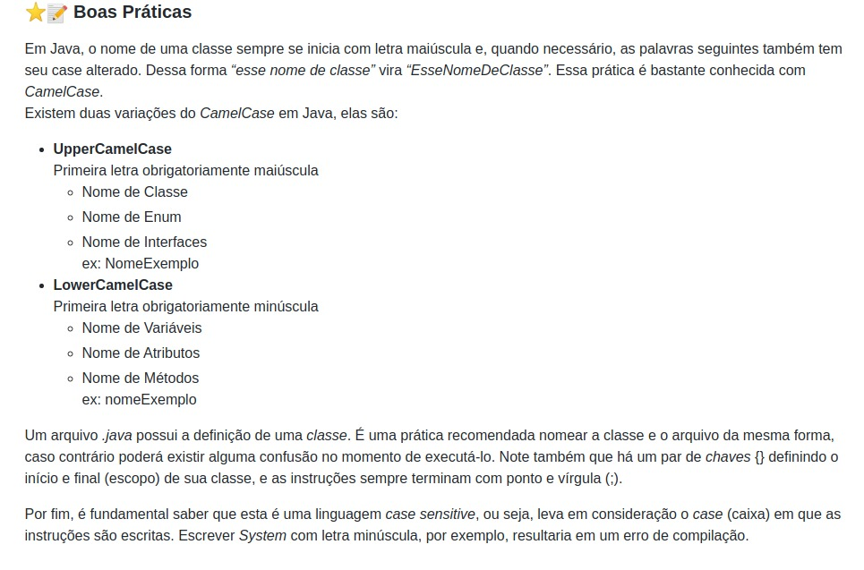

<h1> Boas práticas de programação </h1>
Aqui está um mini compilado sobre como ter boas práticas de programação, se você iniciou no curso por aqui, peço por gentileza que siga a ordem das pastas pois não irá fazer muito sentido, isso é para o fim do curso.

Durante o curso, é ensinado aos poucos as boas práticas básicas de programação, abaixo está um compilado como referência para você se lembrar.

<li> <a href="#"> Indentação e documentação </a> </li>
<li> <a href="#"> Nomes claros de variáveis </a> </li>
<li><a href="#"> Estrutura de Repetições utilizando i e j</li>
<li> <a href="#"> Nomes claros de funções </a> </li>

>Retirado do repósitorio do <a href="https://github.com/hellowluan/java-basico" target="_blank"> Hellowluan
 </a>

